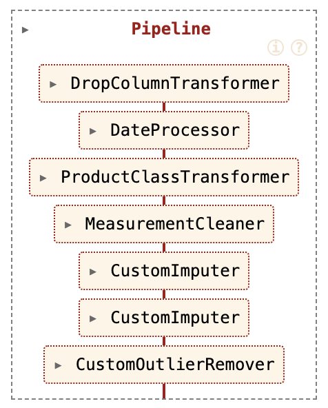
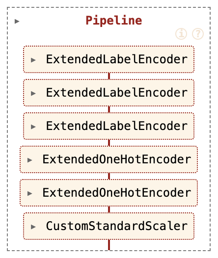
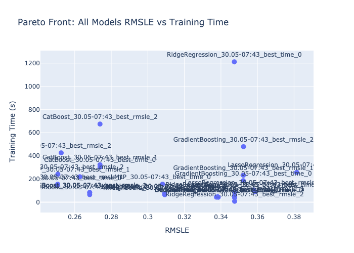
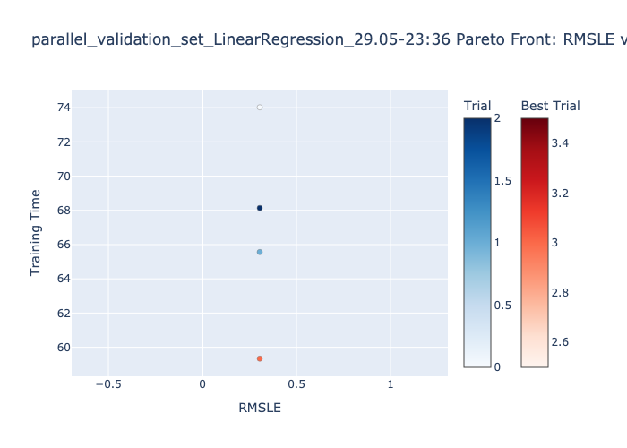
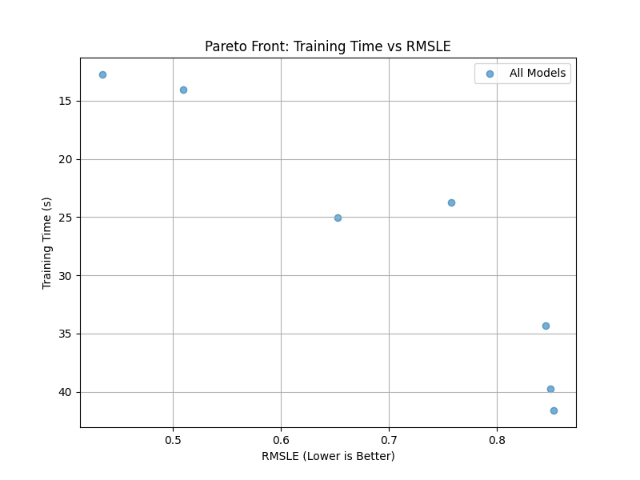
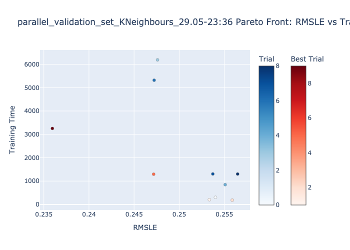
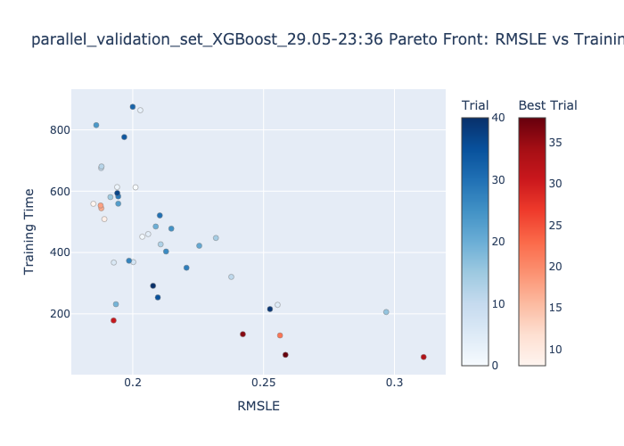
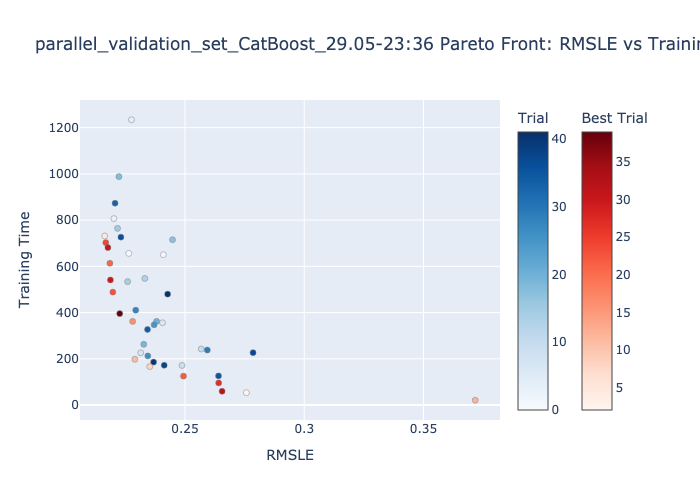
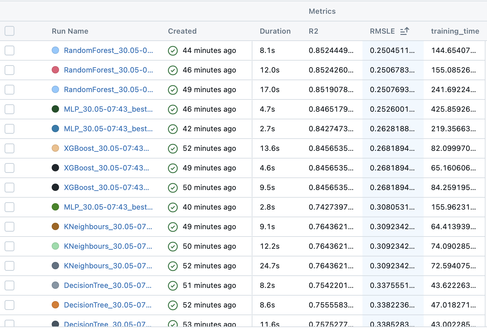

# Project Summary – Bluebook for Bulldozers

In this project, we tackled the **Bluebook for Bulldozers** regression challenge. The dataset was large and complex, with **401,125 rows and 53 columns**, most of which were of `object` type. It contained **many missing values** and **inconsistent or messy measurements**, requiring extensive **data extraction and cleaning**. Additionally, we had to **merge external CSV files** to enrich the dataset with more information.

We conducted an **exploratory data analysis (EDA)** to better understand the data, detect patterns, and identify potential issues. Based on this, we designed a **data cleaning pipeline** and a **preprocessing pipeline**, which are presented in the following diagrams:  

---

## Modeling and Optimization

Modeling was challenging due to the dataset’s size and complexity. Training was **time-consuming**, and finding the right **hyperparameters** was non-trivial. Striking a balance between **model accuracy** and **training time** was particularly difficult.

The competition metric was **RMSLE (Root Mean Squared Logarithmic Error)**. To optimize both accuracy and efficiency, we used **Optuna with Pareto front optimization** on the validation set. We then tested the **best models** based on three criteria:

- Best **RMSLE**  
- Best **training time**  
- Best **combination of both**

The performance of the top models from each group is illustrated below:  

---

## Model Performance

We experimented with **simpler models** like **linear regression with regularization**, but their performance was poor, likely due to the complexity of the dataset. **More advanced models** performed better. In general, **more training time** led to **better RMSLE**, but in some cases, the improvement was minor and did not justify the extra time – making **faster models more practical**.

### Training Time vs RMSLE Comparisons

Below are the comparisons of training time versus RMSLE for each model:

#### Linear Regression  

#### Ridge Regression  

#### Lasso Regression  

#### Decision Tree  

#### K-Nearest Neighbors Regressor  

#### XGBoost  

#### Multi-Layer Perceptron (MLP)  

#### CatBoost  

#### Gradient Boosting  

---

### Best Models

Overall, the top-performing models delivered comparable results. The **Random Forest** models achieved the best RMSLE scores along with solid training times. While **XGBoost** had slightly higher RMSLE, it offered faster training—around 70 seconds—making it a more efficient alternative with only a minor trade-off in accuracy.

---

## Comparison with Baseline

We also compared our results with a **baseline Random Forest Regressor model** posted by another user on Kaggle.

| Model | RMSLE | R² |
|-------|-------|----|
| Baseline Random Forest Regressor | 0.24385858775285324 | 0.2832177793912945 |
| Our Random Forest Regressor | 0.2504511279508592 | 0.8524449704268972 |

As shown above, **our models performed similarly to the baseline** – in general it turned out that Random Forest Regressor was most efficient in means of RMSLE and time from all of our models.

---

## Web Application

To wrap up the project, we developed a **web application** that allows users to **input bulldozer data and receive a predicted resale price**. Given the project's complexity and time constraints, we have only managed to deploy one model - **CatBoost**.
