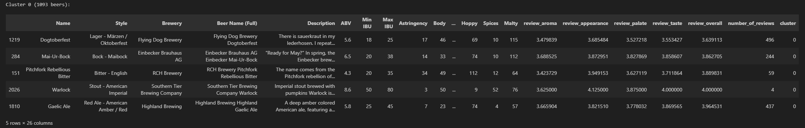

# Project Summary and Cluster Analysis

## Data Loading and Preprocessing

The raw beer dataset was loaded (using KaggleHub) into a DataFrame of **3,197 rows and 25 columns**.  
Initial inspection confirmed **no missing values or duplicate rows**.  

A custom cleaning pipeline was applied:

- `TextCleaner` removed spurious prefixes (e.g. “Notes:”, “error entering this description”) from the “Description” field.
- `CustomOutlierRemover` (z-score threshold = 3) dropped extreme numeric values.

After cleaning, the data shrank to **2,595 rows (still 25 columns)**, indicating ~600 outliers were removed.  
(For example, 1,193 cells in the cleaned “Description” field were empty.)

Finally, a preprocessing pipeline vectorized and scaled features:

- Tokenized textual fields (`Name`, `Description`, `Beer Name (Full)`) into numeric vectors (vocab sizes 300, 1000, 500).
- One-hot encoded categorical columns (`Style`, `Brewery`).
- Applied standard scaling to all numeric attributes.

The result was a final feature matrix of shape **2595 × 2789**.

---

## Exploratory Data Analysis (EDA)

EDA confirmed:

- Dataset: 3,197 beer reviews, 25 features, with both categorical and numerical attributes.
- Review scores (aroma, appearance, palate, taste, overall) were roughly normal and **clustered between 3.0 and 4.5**, reflecting generally positive ratings.
- The “review” attributes were *highly correlated*:
  - palate–taste ≈ 0.95
  - taste–overall ≈ 0.94
- **Appearance** showed slightly weaker correlation with overall scores.
- Some beers and styles dominated the categorical features.

Features were standardized to mitigate scale differences and multicollinearity (especially for the review scores).

---

## Clustering Analysis

**Algorithms used:**

- K-Means
- Gaussian Mixture Models (GMM)
- DBSCAN
- HDBSCAN
- Agglomerative Clustering
- MeanShift

### Full Feature Set
Several clustering algorithms were applied to the preprocessed data. K-Means was tuned using the elbow method and silhouette score. The elbow plot suggested *k* ≈ 8, but silhouette peaked at *k* = 2 (silhouette ≈ 0.12). Thus **k=2** was chosen for K-Means.

- **K-Means (k=2)**:  
  - Silhouette ≈ 0.115  
  - Calinski–Harabasz ≈ 193.2  
  - Davies–Bouldin ≈ 3.62  
- **Gaussian Mixture (k=2)**: Identical results.
- DBSCAN, HDBSCAN, MeanShift, Agglomerative performed worse.
- **Conclusion**: K-Means (k=2) was the best.

### Sensory Features (Review Scores)

- **Agglomerative Clustering (k=2)**:
  - Silhouette ≈ 0.513  
  - CH ≈ 2762.6  
  - DB ≈ 0.703
- **K-Means**: Silhouette ≈ 0.491
- Other methods scored lower.
- **Conclusion**: Agglomerative was best for sensory attributes.

### Profile Features (Flavor/Taste)

- **K-Means (k=6)**:
  - Silhouette ≈ 0.207  
  - CH ≈ 504.6  
  - DB ≈ 1.466
- Agglomerative and GMM performed worse.
- **Conclusion**: K-Means (k=6) was the best for flavor profiles.

### Chemical Features (ABV and IBU)

- **K-Means (k=2)**:
  - Silhouette ≈ 0.515  
  - CH ≈ 2293.1  
  - DB ≈ 0.852
- Agglomerative, GMM were close but slightly worse.
- **Conclusion**: K-Means (k=2) performed best for chemical features.

### Review Counts

- **HDBSCAN**:
  - Clusters ≈ 210  
  - Silhouette ≈ 0.755  
  - CH ≈ 212.0  
  - DB ≈ 1.638
- **K-Means (k=3)**: Silhouette ≈ 0.684
- **Agglomerative (k=3)**: Silhouette ≈ 0.710
- **Conclusion**: HDBSCAN performed best for highly skewed count data.

---

## Cluster Naming, Samples and Interpretation

Note that we pick only random sample from each cluster to illustrate the characteristics of the clusters. In some cases, the sample may not be representative of the entire cluster.

### Full Dataset — K-Means (k=2)

**Cluster 0**: _Popular well-reviewed Beers_  
  - Review metrics are significantly positive, suggesting highly rated beers.
  - All of the flavour profiles show substantial presence, suggesting beers with rich and complex flavors.
  - High number of reviews, indicating popularity.

Analysing the beer characteristics, this cluster might include well-known craft beers or popular brands that are highly rated by consumers.

**Cluster 1**: _Local less-reviewed Beers_  
  - All of the review metrics are closer to zero, suggesting less favorable reviews.
  - Flavour profiles are very close to zero, indicating beers with less complex flavors.
  - Low number of reviews, indicating local or unpopular beers.

Analysing the beer characteristics, this cluster might include local craft beers or lesser-known brands that have not gained widespread popularity.

---

### Sensory Features — Agglomerative Clustering (k=2)

**Cluster 0**: _Beers with high reviews_  
  - All sensory review metrics are very high
  - Indicates beers with strong aroma, appearance, palate, taste, and overall ratings.

Analysing the beer characteristics, this cluster might include popular craft beers or well-known brands that are highly rated by consumers.

**Cluster 1**: _Beers with low reviews_  
- All sensory review metrics are very low and consistently negative.
- Indicates beers with poor aroma, appearance, palate, taste, and overall ratings.

Analysing the beer characteristics, this cluster might include mass-produced lagers or budget beers that are less favored by consumers.

---

### Flavor Profile Features — K-Means (k=6)

**Cluster 0**: _Subtle & Balanced_
- Characterized by low values across all flavor attributes, suggesting a beer without a single dominant characteristic.
- This cluster likely represents beers that are mild, well-rounded, and do not strongly emphasize any particular taste profile.

Analysing the beer characteristics, this cluster might include light lagers or wheat beers that are easy to drink and not overly complex.

**Cluster 1**: _Fruity Sour & Astringent_
- High values for sour, fruits, and astringency, with elevated notes of sweet and spices.
- This cluster indicates beers that are distinctly tart and fruity, potentially with a dry, puckering finish, and some underlying sweetness and spice.

Analysing the beer characteristics, this cluster might include sour ales or fruit lambics that are refreshing and complex.

**Cluster 2**: _Rich Malty & Bitter_
- High values for malty, body, and bitter, with elevated notes of sweet and hoppy.
- This cluster suggests robust beers with prominent maltiness, a full mouthfeel, and significant bitterness, complemented by some sweetness and hop character.

Analysing the beer characteristics, this cluster might include strong ales or IPAs that are rich and flavorful.

**Cluster 3**: _Assertive Hoppy & Bitter_
- High values for hoppy, astringency, bitter, and salty.
- This cluster points to beers that are strongly hoppy and bitter, likely with a dry, somewhat harsh finish, and an unusual salty undertone.

Analysing the beer characteristics, this cluster might include double IPAs or imperial stouts that are intense and bold.

**Cluster 4**: _Spiced & Alcoholic_
- High value for spices, with elevated notes of alcohol, fruits, and body.
- This cluster implies beers with a strong presence of spices, noticeable alcohol warmth, some fruitiness, and a decent body.

Analysing the beer characteristics, this cluster might include spiced ales or winter warmers that are complex and warming.

**Cluster 5**: _Sweet & Boozy_
- High value for sweet and alcohol, with elevated notes of malty, body, and fruits.
- This cluster represents beers that are notably sweet and alcoholic, often accompanied by a substantial malty backbone, full body, and some fruity elements.

Analysing the beer characteristics, this cluster might include barleywines or dessert stouts that are rich and indulgent.

---

### Chemical Features — K-Means (k=2)

**Cluster 0**: _Light Beers_
- Low (slightly negative) values for all chemical properties.
- Represents beers with low alcohol by volume (ABV) and low international bitterness units (IBU), likely light and easy-drinking styles.

Analysing the beer characteristics, this cluster might include light lagers or pilsners that are refreshing and low in alcohol.

**Cluster 1**: _Strong Beers_
- High values across all chemical properties.
- Represents beers with high alcohol by volume (ABV) and high international bitterness units (IBU), indicating stronger, more intense flavors and higher alcohol content.

Analysing the beer characteristics, this cluster might include strong ales or imperial stouts that are rich and complex.

---

### Review Count — HDBSCAN

The HDBSCAN radar plot for review counts is defective and extremely incomplete. It shows only one axis ("number_of_reviews") and absolutely no visual representation of any clusters' mean values. We cannot deduce anything about the clusters themselves or their characteristics from this image, as no data points for cluster means are present. That's why we are not including it in the report.

---

## Comparative Evaluation of Clustering Algorithms

- **K-Means** achieved the best separation in:
  - Full Dataset
  - Profile Features
  - Chemical Features
- **Agglomerative** was best for Sensory Features.
- **HDBSCAN** excelled for Review Count data.

The highest absolute silhouette (0.755) came from HDBSCAN on review counts, but it formed many tiny clusters.  
Overall, **K-Means** proved most effective across the main data subsets.

---
